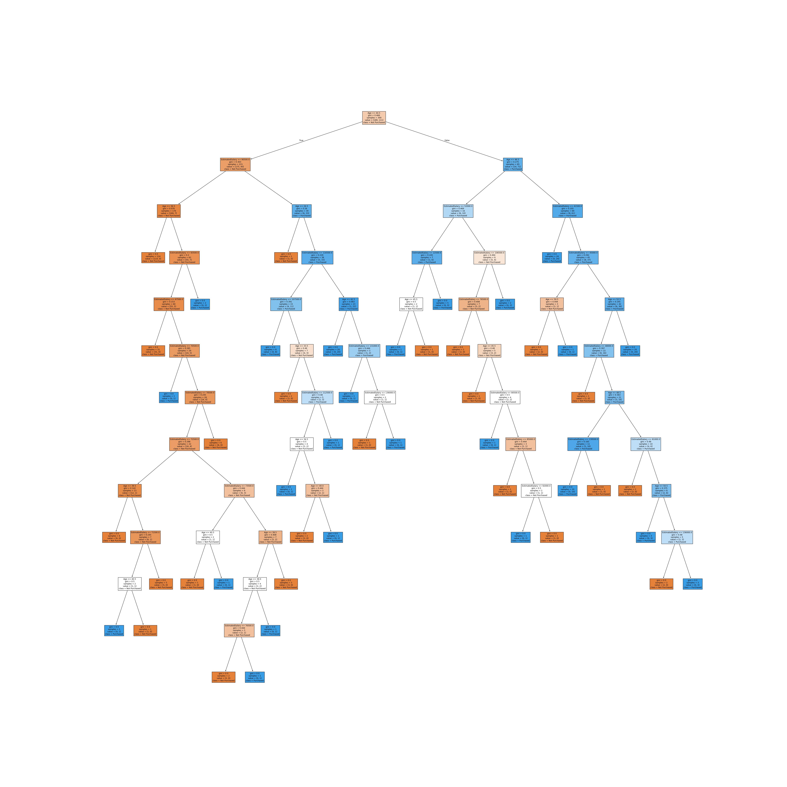

# 🌳 Social Network Ads - Decision Tree Classifier

<p align="center">
  
  
  
</p>

---

## 📌 Project Overview

This Machine Learning project predicts whether a customer will purchase a product based on:

- 👤 **Age**
- 💰 **Estimated Salary**

We used a **Decision Tree Classifier** from Scikit-learn to classify:

- `0` → Not Purchased  
- `1` → Purchased  

---

## 📂 Dataset Information

| Feature | Description |
|----------|-------------|
| Age | Customer Age |
| EstimatedSalary | Customer Estimated Salary |
| Purchased | Target Variable (0 or 1) |

✔ Dataset is clean  
✔ No missing values  
✔ 400 total records  

---

## ⚙️ Project Workflow

```text
1️⃣ Import Required Libraries  
2️⃣ Load Dataset using Pandas  
3️⃣ Check for Null Values  
4️⃣ Separate Dependent & Independent Variables  
5️⃣ Split Data into Training & Testing (75% - 25%)  
6️⃣ Feature Scaling using StandardScaler  
7️⃣ Train Decision Tree Model  
8️⃣ Predict Test Data  
9️⃣ Evaluate using Confusion Matrix & Accuracy  
🔟 Visualize Decision Tree  
```

---

## 📊 Model Performance

### 🔹 Confusion Matrix

|               | Predicted 0 | Predicted 1 |
|--------------|------------|------------|
| Actual 0     | 68         | 0          |
| Actual 1     | 32         | 0          |

### 🎯 Model Accuracy

> ✅ **Decision Tree Accuracy: 68%**

---

## 📈 Data Visualization Example

```python
import seaborn as sns
import matplotlib.pyplot as plt

sns.scatterplot(x='Age', y='EstimatedSalary', hue='Purchased', data=df)
plt.title("Age vs Estimated Salary Distribution")
plt.show()
```

This graph shows how purchase behavior changes based on Age and Salary.

---

## 🌳 Final Model Output – Decision Tree Visualization

Below is the trained Decision Tree model generated from the dataset:

<p align="center">
  
</p>

---

## 🧠 Technologies Used

- Python 🐍
- Pandas
- NumPy
- Matplotlib
- Seaborn
- Scikit-learn

---

## 🚀 Installation & Setup

### 1️⃣ Clone Repository

```bash
git clone https://github.com/your-username/social-network-ads-decision-tree.git
cd social-network-ads-decision-tree
```

### 2️⃣ Install Required Libraries

```bash
pip install pandas numpy matplotlib seaborn scikit-learn
```

### 3️⃣ Run the Script

```bash
python decision_tree.py
```

---

## 📌 Key Learnings

✔ Data Preprocessing  
✔ Feature Scaling  
✔ Train-Test Splitting  
✔ Decision Tree Model Implementation  
✔ Model Evaluation  
✔ Tree Visualization  

---

## 📎 Author

**Vishal Kumar**  
🎓 Artificial Intelligence and Data Science  
💡 Passionate about Data & Machine Learning  

---

## ⭐ Support

If you found this project useful:

- ⭐ Give it a star on GitHub  
- 🍴 Fork it  
- 📢 Share it  

---

> 🚀 This project demonstrates a complete Machine Learning workflow using Decision Tree Classification.
